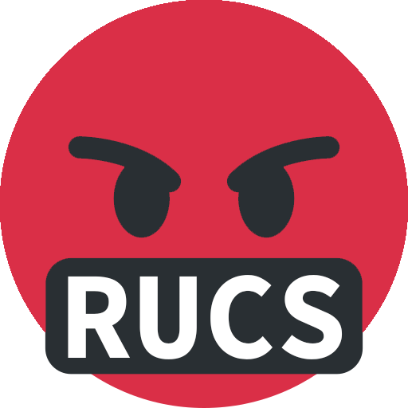

# RUCS Hub - [www.rucshub.com](https://www.rucshub.com)


[](https://opensource.org/licenses/Apache-2.0)

<p align="center">
    
</p>

RUCS Hub is a platform designed for Rutgers computer science students to anonymously review and rate computer science courses and professors.

This project aims to empower students by providing them with valuable insights into the courses and professors within the computer science department. RUCS Hub helps students make informed decisions about their course selections and academic paths.

**RUCS Hub is an independent project and is not directly affiliated with Rutgers University.**

## Table of Contents

- [Features](#features)
- [Usage](#usage)
- [Installation](#installation)
- [Contributing](#contributing)
- [Contact](#contact)
- [License](#license)

## Features

- **Anonymous Reviews**: Students can review and rate courses and professors anonymously.
- **Student Authentication**: Uses student emails for authentication to ensure that only Rutgers students can post reviews.
- **Course and Professor Ratings**: View aggregated ratings and reviews for courses and professors.
- **Search and Filter**: Easily search for and filter courses and professors based on various criteria.
- **Upvote/Downvote Reviews**: Users can upvote or downvote reviews to highlight the most helpful ones.
- **Report Reviews**: Users can report inappropriate or offensive reviews for moderation.

## Usage

1. Sign up or log in using your Rutgers student email.
2. Browse courses and professors to read reviews and ratings.
3. Submit your own reviews for courses and professors you’ve taken.
4. Upvote or downvote reviews to indicate their helpfulness.
5. Report reviews that violate the terms of use.

## Installation

To get started with the project, follow these steps:

1. **Clone the repository**:

```bash
git clone https://github.com/DylanPina/RUCS-Hub.git
cd rucs-hub
```

2. **Install the dependencies**

```bash
npm install
```

3. **Run the development server**

```bash
npm run dev
```

4. **Open your browser and navigate to `http://localhost:3000`**

## Contributing

To contribute to RUCS Hub, follow these steps:

1. Create an issue on the repo: https://github.com/DylanPina/RUCS-Hub/issues.
2. Assign yourself (or someone else) to the new issue.
3. Copy the repo.
4. On your local machine, first git pull then switch to the new branch:

```bash
git pull
git checkout -b feature/your-feature
```

5. Make your changes and commit them:

```bash
git add .
git commit -m "Your commit message"
```

6. Push your changes to the RUCS Hub repo:

```bash
git push
```

7. Create a PR on the repo: https://github.com/DylanPina/RUCS-Hub/pulls.
8. Get signoff from the required reviewers and merge the changes.
9. The repo owner will deploy the changes once the PR is merged.

## Contact

For questions or to reach out, join our Discord server: https://discord.gg/bc2yDRVs, or email us at rucshub@gmail.com.

## License

This project is licensed under the Apache License 2.0. See the LICENSE file for details.
